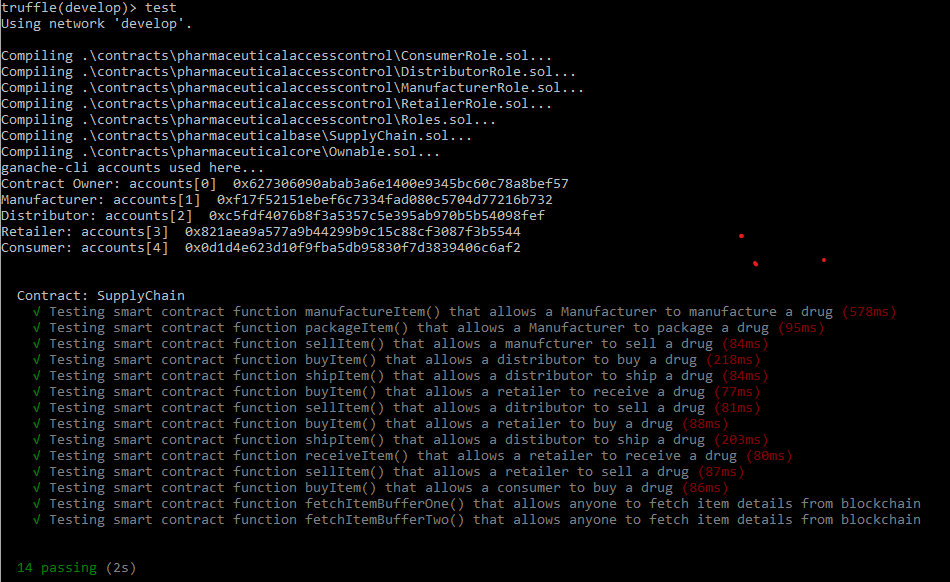
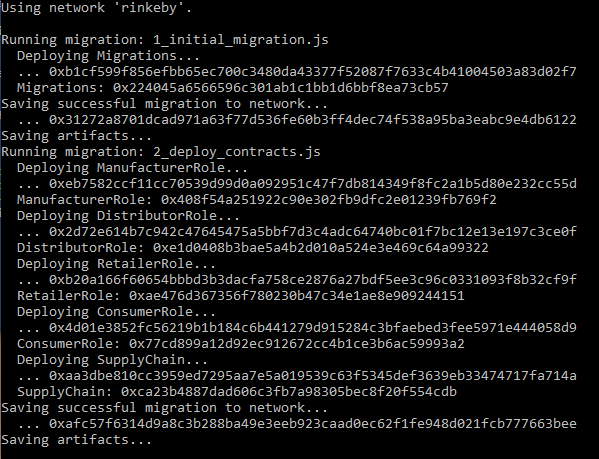
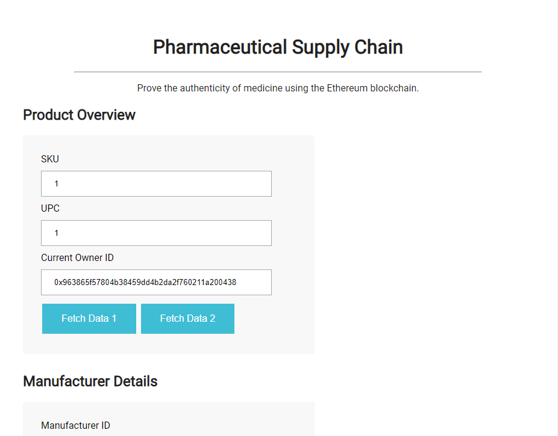

# **Ethereum Pharmaceutical Supply Chain**

The goals of this project are as follows:

- Plan the project with write-ups.
- Write smart contracts.
- Test smart contract code coverage
- Deploy smart contract on public test network.
- Create web client to interact with smart contract

------


## Overview

This project is a Distributed Application (DApp) which includes an [Ethereum](https://www.ethereum.org/) smart contract  and a web front-end.  The smart contract represents a pharmaceutical supply chain implemented with [Solidity](https://github.com/ethereum/solidity) .


------

### Supply Chain Smart Contract

The Supply Chain smart contract ([SupplyChain.sol](contracts/SupplyChain.sol)) is implemented using Solidity.  The contract inherits from a contract that provide ownership ([Ownable.sol](contracts/pharmaceuticalcore/Ownable.sol)) functions.  And contracts based on the Role contract ([Roles.sol](contracts/pharmaceuticalaccesscontrol/Roles.sol)) that implement role-specific functions ([ManufacturerRole.sol](contracts/pharmaceuticalaccesscontrol/ManufacturerRole.sol), [DistributorRole.sol](contracts/pharmaceuticalaccesscontrol/DistributorRole.sol), [RetailerRole.sol](contracts/pharmaceuticalaccesscontrol/RetailerRole.sol), and [ConsumerRole.sol](contracts/pharmaceuticalaccesscontrol/ConsumerRole.sol)).

##### UML Diagrams

UML diagrams describing the contracts and their interactions are listed below.

- [State Diagram](images/State-Diagram.png)
- [Activity Diagram](images/Activity-Diagram.png)
- [Sequence Diagram](images/Sequence-Diagram.png)
- [Class Diagram](images/Class-Diagram.png)

##### Item Struct

The Supply Chain contract includes a `struct` named `Item` ([SupplyChain.sol](contracts/pharmaceuticalbase/SupplyChain.sol) lines -38-54) which holds item information including the current owner, manufacturer, distributor, retailer, and consumer information.)

------

### Smart Contract Unit Tests

Unit tests are located within [TestSupplychain.js](test/TestSupplychain.js).  They are implemented in JavaScript using the [Truffle](https://truffleframework.com/) framework.  The tests can be run by starting [Ganache](https://truffleframework.com/ganache) and executing the following commands (from a Windows Command prompt) from the main project folder.

```bash
C:\truffle.cmd develop

truffle(develop)>test
```

Truffle will compile the solidity contracts located under `contracts` , then deploy the contracts to Ganache and execute the tests located under `test`. An image of the truffle test execution is below.




------

### Deploying to the Ethereum RINKEBY Test Network

Truffle is used to deploy the smart contracts to a target network.   The truffle configuration file ([truffle-config.js](truffle-config.js)) controls where Truffle deploys the project's contracts.   A screenshot of the [truffle-config.js](truffle-config.js) file is shown below.  The config file contains deployment parameters for two networks: *development* and *rinkeby*.

```javascript
require('dotenv').config();
var HDWalletProvider = require('truffle-hdwallet-provider');
var infuraUrl = 'https://rinkeby.infura.io/v3/' + process.env.INFURA_API_KEY;

module.exports = {
  networks: { 
	development: {
		host: '127.0.0.1',
		port: 7545,
		network_id: "*"
	}, 
	rinkeby: {
        provider: function() {
            return new HDWalletProvider(process.env.MNEMONIC, infuraUrl) 
		},
      	network_id: 4,
        gas: 4500000,
        gasPrice: 10000000000,
    }
  }
};
```

The *rinkeby* network configuration tells Truffle to deploy the smart contracts to the RINKEBY test network through the [Infura](https://infura.io/) blockchain infrastructure.    The wallet mnemonic and RINKEBY API key values are retrieved from  [.env](smart_contracts/.env) file using the [dotenv](https://www.npmjs.com/package/dotenv) node.js module.

Running the following commands will initiate the deployment to the RINKEBY test network.

```bash
cd contracts
truffle migrate --network rinkeby
```




------

### Web Front-End

The project includes an HTML test client ([index.html)](src/index.html) that interacts with the contract on the Ethereum RINKEBY test network.  The front-end uses the [Web3 Ethereum JavaScript API](https://web3js.readthedocs.io/en/1.0/) to interact with the supply chain contract on the RINKEBY test network through the [MetaMask](https://metamask.io/) browser plug-in.  

Here is a screen shot of the web client.



The interface interacts with the smart contract to move a drug through the supply chain process; from manufacture to purchase by the end consumer.

------


## Configuring the Project

#### Require Software

The following software must be installed on the host machine.

- Install [Ganache](https://truffleframework.com/ganache) 

  Download and install the version of Ganache for your operating system.

- Install [Truffle](https://truffleframework.com/truffle)

  Run the following command

  ```bash
  npm install truffle -g
  ```

- Install [MetaMax](https://metamask.io/)

  Install the MetaMask [Chrome extension](https://metamask.io/).

- Install Node.js dependencies

  The following node installation command should be executed from the project root directory.

  ```bash
  npm install
  ```

#### Infura Account

The project requires an Infura account. You can create one [here](https://infura.io/).


#### Create an .env file

The truffle test and migration process requires a file named *.env* to be located in the [root](./) folder.  This file must contain your wallet mnemonic and [Infura](https://infura.io/) API URL.

```bash
INFURA_API_KEY=<INFURA API KEY GOES HERE>
MNEMONIC="<WALLET MNEMONIC GOES HERE"
```

